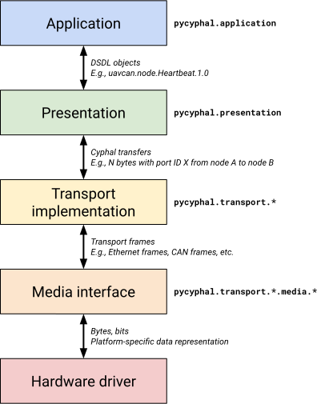

Full-featured Cyphal stack in Python
====================================

        

PyCyphal is a full-featured implementation of the Cyphal protocol stack intended for non-embedded, user-facing applications such as GUI software, diagnostic tools, automation scripts, prototypes, and various R&D cases.

PyCyphal aims to support all features and transport layers of Cyphal, be portable across all major platforms supporting Python, and be extensible to permit low-effort experimentation and testing of new protocol capabilities.

It is designed to support **GNU/Linux**, **MS Windows**, and **macOS** as first-class target platforms. However, the library does not rely on any platform-specific capabilities, so it should be usable with other systems as well.

[Cyphal](https://opencyphal.org) is an open technology for real-time intravehicular distributed computing and communication based on modern networking standards (Ethernet, CAN FD, etc.).

  

**READ THE DOCS: [pycyphal.readthedocs.io](https://pycyphal.readthedocs.io/)**

**Ask questions: [forum.opencyphal.org](https://forum.opencyphal.org/)**

*See also: [**Yakut**](https://github.com/OpenCyphal/yakut) -- a CLI tool for diagnostics and management of Cyphal networks built on top of PyCyphal.*
